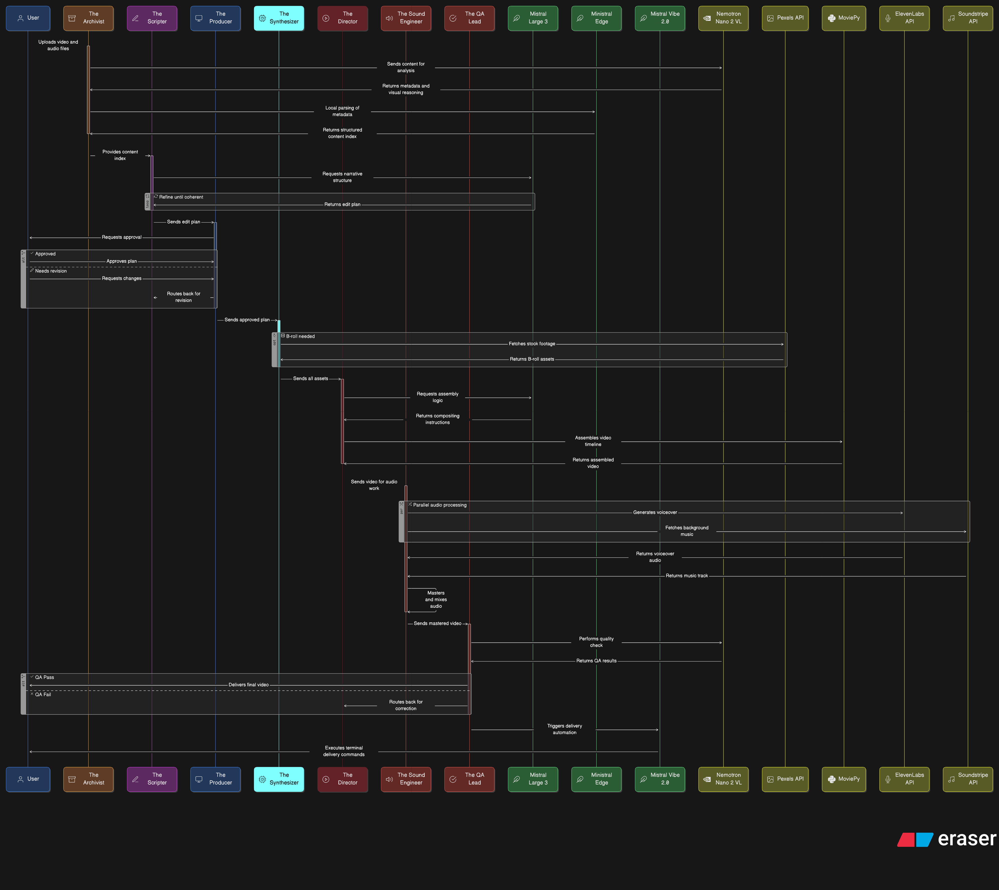
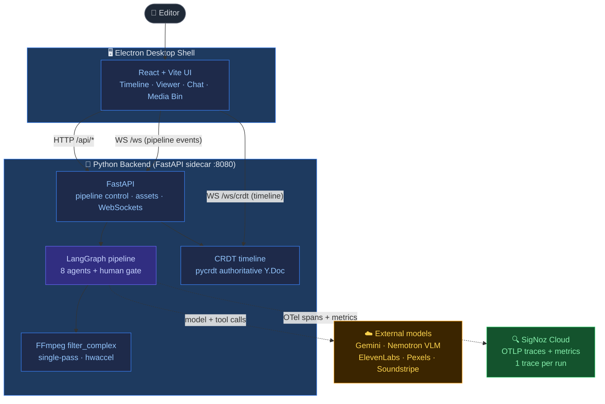
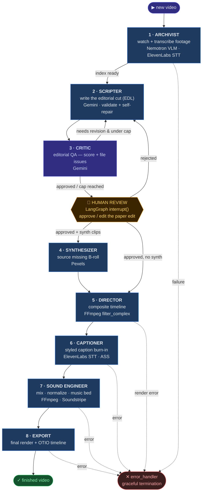
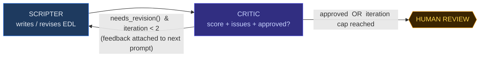
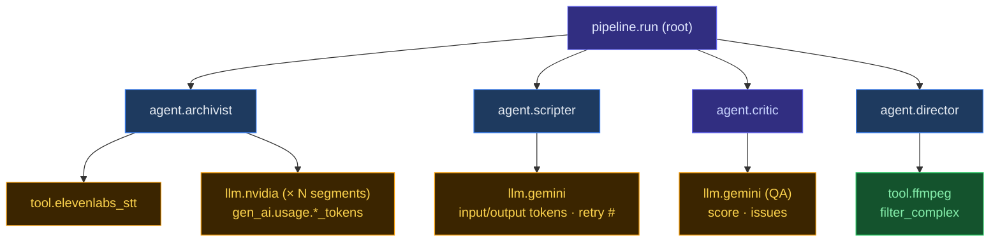

# 🎬 Kinetograph — An Autonomous Multi-Agent Video Editor

**A technical report on the design, architecture, and orchestration of a
LangGraph multi-agent video-editing pipeline — from raw footage to a
broadcast-ready cut, fully instrumented with OpenTelemetry → SigNoz.**

| | |
|---|---|
| **What it is** | An Electron desktop app: describe your video in plain English, and a team of AI agents edits it |
| **Backend API** | FastAPI + LangGraph on `127.0.0.1:8080` (`docs/API.md`) |
| **Observability** | OpenTelemetry traces + metrics → SigNoz Cloud (`backend/observability/`) |

<p align="center">
  
</p>

---

## Abstract

Kinetograph turns a folder of raw clips and a one-line brief — *"cut me a punchy
90-second recap of the hackathon"* — into a finished, captioned, sound-designed
video. It does this the way a real edit bay does: not with one monolithic model,
but with a **team of specialised agents** that hand work to one another in a fixed
order, pausing for a human to approve the paper edit before anything is rendered.
An **Archivist** watches and transcribes the footage; a **Scripter** writes the
editorial cut; a **Critic** reviews that cut and sends it back for revision if it's
weak; a human approves; a **Synthesizer** sources missing B-roll; and a
**Director → Captioner → Sound Engineer → Export** chain renders the final file in
a single hardware-accelerated FFmpeg pass. Every agent, every model call, and every
tool invocation emits an OpenTelemetry span, so a full pipeline run reads as one
clean, debuggable trace in SigNoz.

---

## Highlights

- **A genuine multi-agent graph, not a prompt chain** — eight specialised agents wired as a deterministic LangGraph `StateGraph` (`orchestrator.py`). The order is fixed and legible; there is no opaque LLM router deciding what happens next. Each agent has one job and a typed contract with the next.
- **A Critic/QA agent with a bounded self-repair loop** — the Scripter's editorial cut is reviewed by a separate Critic agent that scores it and files structured issues. If the cut is weak, it goes **back to the Scripter** with the critic's notes attached (real self-repair, not a blind retry) — capped at two revisions so it can never loop forever. This `Scripter → Critic → Scripter → human` handoff is the marquee trace.
- **Human-in-the-loop by construction** — the graph *pauses* at a real LangGraph `interrupt()` after the Critic signs off. Nothing renders until the user approves or edits the paper edit. Approval resumes the exact same graph from a persisted checkpoint.
- **Full OpenTelemetry → SigNoz observability** — one trace per run, with agent spans parenting their LLM/VLM/tool child spans, GenAI semantic-convention attributes (model, input/output tokens), and metrics for per-agent latency, token spend, retries, and errors. Dashboards + an alert ship in `backend/observability/`.
- **A/V-fused footage understanding** — the Archivist doesn't just look at frames; it slices the transcript to each shot and feeds the *speech* into the vision model's prompt, so every segment is described in relation to what's actually being said. Shots are cut on real scene boundaries (FFmpeg scene detection), not blind 4-second slices.
- **Single-pass, hardware-accelerated rendering** — the whole timeline (trims, concats, crossfades, picture-in-picture, caption burn-in) compiles to **one** `ffmpeg -filter_complex` command with VideoToolbox / NVENC / QSV / VAAPI acceleration. ~5–20× faster than the frame-by-frame approach it replaced.
- **A real collaborative timeline (CRDT)** — the timeline is a Yjs/​`pycrdt` CRDT with the backend Y.Doc as the authoritative copy, synced over a dedicated WebSocket and persisted to disk. Timeline edits round-trip through the CRDT, not plain REST.
- **Import-by-reference projects** — a "project" is any folder you choose. Media is referenced in place, never copied; thumbnails, waveforms, and metadata live in a throwaway `.cache/` that regenerates on demand.

---

## Tech stack

| Layer | Technology |
|---|---|
| **Desktop shell** | Electron 33 (spawns the Python backend as a managed sidecar) |
| **Frontend** | React 19 + Vite 6 + Tailwind CSS v4 + Zustand 5 |
| **Backend** | Python 3.11+, FastAPI, Uvicorn |
| **Agent orchestration** | LangGraph `StateGraph` (deterministic, checkpointed) — `archivist → scripter → critic → human_review → [synthesizer] → director → captioner → sound_engineer → export` |
| **LLM (scripting + critique)** | Google Gemini 2.5 Flash via `google-genai`, structured output via `response_schema` |
| **VLM (footage analysis)** | NVIDIA Nemotron VLM (OpenAI-compatible NIM endpoint) |
| **Speech-to-text** | ElevenLabs STT |
| **Stock B-roll** | Pexels video search API |
| **Background music** | Soundstripe |
| **Rendering** | FFmpeg `filter_complex`, single-pass, hardware-accelerated (`hwaccel.py` smoke-tests encoders at startup) |
| **Collaborative timeline** | Yjs (frontend) ↔ `pycrdt` (backend), authoritative Y.Doc |
| **State & resume** | LangGraph `AsyncSqliteSaver` over `aiosqlite` — per-project checkpoint DB |
| **Observability** | OpenTelemetry SDK (traces + metrics), OTLP/HTTP exporter → **SigNoz Cloud** |
| **Timeline interchange** | OpenTimelineIO (OTIO) export |

---

## 1. Problem statement

Editing video is slow, skilled, and mechanical in equal measure. The mechanical
part — watching every clip, finding the good moments, matching B-roll to the
narration, timing captions to speech, mixing music under dialogue, colour-grading,
exporting — is exactly the part a machine should do. But a single LLM asked to
"edit this video" is a black box: you can't see *why* it chose a clip, you can't
correct it mid-flight, and when it produces a bad cut you have no idea which
decision went wrong.

Kinetograph's thesis is that video editing is naturally a **multi-agent, human-in-the-loop
workflow**, and that framing it that way makes it both better and *observable*.
Split the job into specialists, give them typed contracts, insert a QA critic and a
human approval gate, and instrument every handoff. The result is a system a human
can supervise and a system an engineer can debug — every run is one trace.

---

## 2. System architecture

The desktop app and the AI pipeline are two processes. Electron owns the window and
spawns the Python backend as a child "sidecar" on port 8080; they talk over HTTP for
control and **two** WebSockets for real-time state — one for pipeline events, one for
the collaborative timeline.



Two design choices matter most here. First, **the backend Y.Doc is the source of
truth for the timeline** — the frontend Yjs doc syncs against it, so multiple
views (and, later, multiple users) stay consistent, and the timeline survives a
restart. Second, **the pipeline is deterministic**: the LangGraph order is fixed in
code, so the same brief takes the same path every time and the trace is always
shaped the same way.

---

## 3. The multi-agent pipeline

Every fresh video runs the full graph below. It is a real `StateGraph`
(`orchestrator.py`) — nodes are agents, edges are either unconditional handoffs or
small deterministic routing functions. The only branch decided at runtime by a
model's *output* (not by an LLM router) is the Critic's revise-or-proceed decision.



The pipeline's shared memory is a single `GraphState` (`state.py`) — a LangGraph
`TypedDict` whose list fields (`errors`, `completed_agents`, …) use append-reducers,
so each agent contributes to the record without clobbering it. The **Editorial
Decision List (EDL)** — a typed Pydantic v2 document (`schema.py`) — is the object
that flows from the Scripter through the Critic, the human gate, and into rendering.
It is the single source of truth: not just *which* clips at *what* times, but the
editorial reasoning behind each one (act, beat, purpose, confidence).

> **Edits don't re-run the whole graph.** A post-render tweak ("make the music
> louder", "change the caption font", "re-grade it warmer") is classified by a small
> keyword rule (`_classify_edit` in `server.py`) that picks the right *entry point* —
> `sound_engineer`, `captioner`, `director`, or `scripter` — and the graph is
> recompiled to start there. Only content changes go back through the Scripter and
> the human gate.

---

## 4. The agents, phase by phase

### Phase 1 · Archivist — *understand the footage*

The Archivist is the eyes and ears of the pipeline. For every imported clip it does
two things in parallel: it **transcribes the audio** with ElevenLabs STT (word-level
timestamps), and it **watches the video** with the NVIDIA Nemotron vision-language
model.

The interesting part is that these two streams are *fused*. Rather than cutting the
video into blind 4-second slices, the Archivist runs FFmpeg **scene detection**
(`select='gt(scene,0.3)'`) to find real shot boundaries, then builds analysis
windows that never straddle a cut and subdivide long takes. For each window it
slices out the transcript overlapping that shot and feeds *that speech* into the
VLM prompt — so the model describes a shot **in relation to what's being said over
it**, not in a vacuum. The VLM returns strict structured JSON (`SegmentVisual`):
subject, setting, action, notable detail, clip type, plus **energy, salience, and
emotion** scores. Those scores are aggregated onto every entry in the `master_index`
— giving the Scripter and Critic a real ranking signal for picking the hook and the
best moments, instead of guessing.

*Tech: NVIDIA Nemotron VLM · ElevenLabs STT · FFmpeg scene detection. Every VLM call
is one `llm.nvidia` span; the parallel per-segment fan-out is visible in the trace.*

### Phase 2 · Scripter — *write the cut*

The Scripter takes the brief and the analysed index and writes the **Editorial
Decision List**: an ordered list of clips with in/out points, transitions, overlays,
a music spec, and — crucially — the editorial rationale for each choice. It asks
Gemini for structured output and then **validates and clamps** the result against
the constraints the prompt demanded: primary clips snap to exact segment boundaries,
cutaways are clamped to 2–4 seconds and can't outrun the shot they cover, duplicate
clip IDs are de-duplicated, invalid transitions fall back to safe defaults. Only
genuinely unfixable problems (an inverted time range, a missing source file) become
errors.

When validation *does* find fixable-but-wrong output, the Scripter doesn't blindly
re-call the model — it feeds the specific validation errors back into the next
attempt's prompt ("FIX THESE VALIDATION ERRORS: …"). That's real self-repair, and it
collapses the entire class of "the model returned slightly malformed JSON" failures.

*Tech: Gemini 2.5 Flash with `response_schema` · schema-driven validation. One
`llm.gemini` span per attempt, with token usage and any retry recorded.*

### Phase 3 · Critic — *review the cut* → see §5

### Phase 4 · Synthesizer — *fill the visual gaps*

Runs **only if** the approved edit contains clips marked `synth` — i.e. moments where
the Scripter wanted cutaway B-roll the user didn't provide. For each such clip it
searches Pexels for stock footage matching the clip's query and orientation,
downloads the best-fitting result (closest duration match), probes it to confirm
it's valid, and caches it in the project's `media/.synth/`. Searches and downloads
run in parallel with a concurrency cap of three. If a clip can't be sourced it's
recorded as a recoverable error and the pipeline continues rather than dying.

*Tech: Pexels video search + async `httpx` downloads. Each search is a
`tool.pexels_search` span.*

### Phase 5 · Director — *composite the picture*

The Director turns the approved timeline into pixels. It hands the whole timeline —
every trim, concat, crossfade, picture-in-picture overlay, and caption burn-in — to
the `FilterGraphBuilder` (`core/compositor.py`), which compiles it into **one**
`ffmpeg -filter_complex` command and runs it with hardware acceleration. This is a
single decode→filter→encode pass, not a clip-by-clip render. See §7.

### Phase 6 · Captioner — *time the words to the speech*

Generates styled captions and burns them in. It uses ElevenLabs STT word timings to
place caption events precisely against the dialogue, renders them as ASS subtitles,
and (in the single-pass design) the burn-in is folded into the Director's filter
graph rather than being a separate re-encode.

### Phase 7 · Sound Engineer — *mix the audio*

Normalizes loudness (LUFS), applies denoise/EQ, and lays a background-music bed under
the dialogue using the `MusicSpec` the Scripter emitted (vibe / genre / energy curve),
sourced from Soundstripe. Like captions, the audio work is consolidated into one
FFmpeg pass instead of a chain of re-encodes.

### Phase 8 · Export — *finalize and hand off*

Produces the final graded file and writes an **OpenTimelineIO** timeline alongside
it, so the cut can be round-tripped into professional NLEs (Resolve, Premiere) if the
editor wants to take it further by hand.

---

## 5. The Critic/QA loop — the visible multi-agent handoff

A single agent writing a cut has no second opinion. Kinetograph adds one: a separate
**Critic agent** whose only job is editorial QA. It reviews the Scripter's EDL against
the brief and the footage index and returns **structured feedback** — a list of
issues (each with a severity, the offending clip, a message, and a suggested fix), an
overall score, and an `approved` verdict. It reasons over the same typed EDL the
Scripter produced, so its critique is grounded in structure (act balance, hook
strength, does each cutaway actually relate to the speech under it, does the duration
math add up, is the pacing right).

The routing is a bounded self-repair loop, not an open-ended debate:



Three properties make this safe and useful:

- **It's bounded.** `CRITIC_MAX_ITERATIONS = 2`. The loop can revise at most twice
  before handing off to the human regardless of the score — it can never spin.
- **It's real self-repair.** On a revise, the Critic's specific issues are attached to
  the Scripter's next prompt, so the second draft addresses the *named* problems.
- **It degrades safely.** If the Critic call fails or its output won't parse, the
  route falls through to the human gate — a flaky QA model never dead-ends a run.

In a trace, this is the money shot: `agent.scripter → agent.critic → agent.scripter →
agent.human_review`, with the revise decision, the score, and the issue count all
readable as span attributes.

---

## 6. Observability — OpenTelemetry → SigNoz

Because the pipeline is a real agent graph, it produces a naturally nested trace: one
root span per run, an agent span per node, and LLM/tool child spans underneath. The
instrumentation lives in one module (`observability.py`) and is wired in at a single
choke point — the orchestrator's node factory `_make_node` wraps *every* agent in an
`agent_span` at once — plus a handful of `llm_span` / `tool_span` context managers at
the actual model and tool call sites.



**Spans carry GenAI semantic conventions.** LLM/VLM spans set `gen_ai.system`,
`gen_ai.request.model`, and `gen_ai.usage.input_tokens` / `output_tokens` (extracted
straight from the Gemini and NVIDIA response bodies), so SigNoz's LLM views light up
without custom wiring. Agent spans add domain attributes — the phase they produced,
index size, clip count, error count.

**Errors are recorded honestly.** Kinetograph's post-approval agents *return*
`{"phase": "error"}` rather than raising, so a naïve tracer would paint a failed
render green. `_make_node` inspects the returned phase and, on error, sets the span
status to `ERROR` with the actual message and increments the error counter — so a
broken agent shows up red in SigNoz with its reason attached.

**Metrics feed dashboards + an alert.** Five instruments are exported:

| Metric | Type | What it tells you |
|---|---|---|
| `kinetograph.agent.latency` | histogram (ms) | where a run spends its time, per agent |
| `kinetograph.llm.tokens` | counter | token spend, split by system/model and direction |
| `kinetograph.llm.calls` | counter | how many model calls a run made |
| `kinetograph.agent.errors` | counter | failures per agent |
| `kinetograph.agent.retries` | counter | retry pressure (e.g. Scripter self-repair, VLM 429s) |

A ready-made SigNoz **dashboard** (agent latency breakdown, tokens + cost per run,
retries/errors per agent, critic revise-rate, end-to-end duration) and an **alert**
(pipeline error / cost threshold) live in `backend/observability/` as importable
JSON, alongside a smoke-test that emits a full synthetic multi-agent trace so you can
verify the SigNoz wiring before running a real pipeline.

**It's safe by default.** Telemetry is opt-in: nothing is exported unless
`KINETOGRAPH_TELEMETRY=1` is set. With it off (the dev default) every span helper is a
cheap no-op — the OpenTelemetry API returns no-op tracers — so a down collector or a
missing endpoint can never fail or slow a pipeline run.

```bash
# turn on the SigNoz export (see backend/observability/README.md)
KINETOGRAPH_TELEMETRY=1
OTEL_EXPORTER_OTLP_ENDPOINT=https://ingest.<region>.signoz.cloud:443
OTEL_EXPORTER_OTLP_HEADERS=signoz-ingestion-key=<your-key>
```

---

## 7. The rendering engine — one FFmpeg pass

Kinetograph renders in a **single FFmpeg process** using `-filter_complex`, replacing
the frame-by-frame Python/NumPy approach it started with. This is 5–20× faster on most
hardware because pixels never leave the FFmpeg address space.

1. **`hwaccel.py`** smoke-tests encoders at startup in priority order —
   `h264_videotoolbox` (macOS) → `h264_nvenc` (NVIDIA) → `h264_qsv` (Intel) →
   `h264_vaapi` (Linux) → `libx264` (software) — and picks the fastest that actually
   works on this machine.
2. **`compositor.py`**'s `FilterGraphBuilder` incrementally builds the timeline as a
   DAG of filter expressions (trim, concat, xfade, PiP overlay, caption burn-in) and
   compiles the whole thing into one command.
3. **Single-pass.** Caption burn-in and audio mastering are folded into the Director's
   filter graph instead of being separate re-encode passes.
4. **Async subprocess.** Every FFmpeg call is `asyncio.create_subprocess_exec`, so the
   FastAPI event loop is never blocked during a render.

```
Before (MoviePy):  decode → Python/NumPy → encode  × 3 passes   ≈ 40s for a 60s video
After  (FFmpeg):   filter_complex → single pass (hwaccel)       ≈  4s for a 60s video
```

---

## 8. The collaborative timeline (CRDT)

The timeline isn't plain application state — it's a **CRDT**. The frontend runs a Yjs
document; the backend runs `pycrdt` and holds the **authoritative** Y.Doc, which
persists to `state/crdt_snapshot.yjs`. The two sync over a dedicated `/ws/crdt`
WebSocket with origin-based broadcast, so edits made in the UI and edits made by the
pipeline (e.g. the Director writing rendered timings) converge without conflict, and
the timeline survives a restart. When you change timeline behaviour, the change has to
round-trip through the CRDT — not through REST — which is what keeps every view (and,
in the future, every collaborator) consistent.

---

## 9. State, checkpointing & human-in-the-loop

The human approval gate is a first-class part of the graph, not a UI afterthought.
The `human_review` node calls LangGraph's `interrupt()`, which **suspends the graph**
and persists a checkpoint. The run is genuinely paused: the process can restart and
the pending approval survives, because each project has its own checkpoint database
(`AsyncSqliteSaver` over `aiosqlite`, fully async so it never blocks the event loop).
When the user approves via `/api/pipeline/approve`, the graph resumes from that exact
checkpoint and continues into synthesis/render. Rejecting instead loops back to the
Scripter for another draft.

---

## 10. Getting started

### Prerequisites
- **Python 3.11+**, **Node.js 20+**, **FFmpeg** on `PATH`
- API keys (see §11)

### Run everything (recommended)

```bash
./dev.sh            # preflight-checks the venv, backend install, node_modules,
                    # FFmpeg and .env, then launches backend + Electron together
```

`./dev.sh` also supports running the halves separately:

```bash
./dev.sh backend    # backend only — uvicorn --reload on :8080
./dev.sh desktop    # frontend only — sets KINETOGRAPH_EXTERNAL_BACKEND=1 so
                    # Electron won't spawn its own backend
```

### Manual / first-time setup

```bash
python3 -m venv .venv && source .venv/bin/activate
pip install -e "backend/[dev]"        # editable install with pytest + ruff
cd desktop && npm install && cd ..
cp .env.example .env                  # then fill in API keys (§11)
```

### Headless pipeline (no UI)

```bash
kinetograph run "<your prompt>" --project <name>   # python -m kinetograph
```

### Tests · lint · typecheck

```bash
cd backend && pytest                  # full suite (pytest-asyncio)
cd backend && ruff check src/         # line-length 100, rules E/F/I/W
cd desktop && npm run typecheck       # tsc --noEmit
```

### Distribution builds

```bash
cd desktop && npm run build           # add -- --win / -- --linux; output in desktop/release/
```

Production bundles the Python backend via PyInstaller — see `desktop/package.json` →
`build.extraResources`.

---

## 11. Configuration

Copy `.env.example` to `.env` and fill in your keys (or use the in-app **Settings**
page, which writes them back to `.env`):

| Variable | Required | Purpose |
|---|---|---|
| `GEMINI_API_KEY` | **Yes** | Scripter + Critic (Gemini 2.5 Flash) |
| `ELEVENLABS_API_KEY` | **Yes** | Speech-to-text (Archivist + Captioner) |
| `NVIDIA_API_KEY` | Recommended | Nemotron VLM footage analysis |
| `PEXELS_API_KEY` | Recommended | Synthesizer stock B-roll |
| `SOUNDSTRIPE_API_KEY` | Optional | Background music |
| `HF_TOKEN` | Optional | Alternative VLM hosting |
| `KINETOGRAPH_TELEMETRY` | Optional | `1` to export traces/metrics to SigNoz |
| `OTEL_EXPORTER_OTLP_ENDPOINT` | With telemetry | SigNoz OTLP ingest endpoint |
| `OTEL_EXPORTER_OTLP_HEADERS` | With telemetry | `signoz-ingestion-key=<key>` |

Models default to `gemini-2.5-flash-preview-05-20` and `nvidia/nemotron-nano-12b-v2-vl`,
overridable via env or the Settings page.

---

## 12. Repository map

```
AI-Production-backend/
├── backend/                          THE AI PIPELINE + API SERVER
│   ├── src/kinetograph/
│   │   ├── orchestrator.py           LangGraph StateGraph — nodes, edges, routing
│   │   ├── state.py                  GraphState TypedDict (append-reducer fields)
│   │   ├── schema.py                 typed EDL (Pydantic v2) + CriticFeedback + enums
│   │   ├── observability.py          OpenTelemetry → SigNoz (agent/llm/tool spans + metrics)
│   │   ├── server.py                 FastAPI app: pipeline control · assets · WebSockets
│   │   ├── config.py                 pydantic-settings (.env) — importable singleton
│   │   ├── crdt.py                   pycrdt authoritative timeline Y.Doc
│   │   ├── cli.py                    headless pipeline entry point
│   │   ├── agents/                   ONE MODULE PER PIPELINE NODE
│   │   │   ├── archivist.py          A/V fusion · structured VLM output · shot detection
│   │   │   ├── scripter.py           EDL authoring · validate + self-repair · music spec
│   │   │   ├── critic.py             editorial QA — score + structured issues (bounded loop)
│   │   │   ├── producer.py           human-review gate (LangGraph interrupt)
│   │   │   ├── synthesizer.py        Pexels B-roll sourcing (parallel, cached)
│   │   │   ├── director.py           timeline → FFmpeg filter_complex
│   │   │   ├── captioner.py          ASS captions timed to STT
│   │   │   ├── sound_engineer.py     LUFS normalize · EQ · music bed
│   │   │   └── export.py             final render + OTIO timeline
│   │   └── core/                     SHARED RENDERING
│   │       ├── compositor.py         FilterGraphBuilder — whole timeline → one command
│   │       ├── hwaccel.py            startup encoder smoke-test (videotoolbox→…→libx264)
│   │       ├── media.py              ffprobe + scene detection + async FFmpeg
│   │       ├── music.py              Soundstripe integration
│   │       ├── captions.py           ASS subtitle rendering
│   │       └── timeline.py           OpenTimelineIO export
│   ├── observability/                SIGNOZ ASSETS — dashboard.json · alert.md · smoke_test.py
│   ├── tests/                        pytest — units · observability · schema · archivist · scripter
│   └── pyproject.toml
│
├── desktop/                          ELECTRON + REACT DESKTOP APP
│   ├── electron/main.ts              backend sidecar lifecycle · project switching · .env writes
│   ├── src/lib/api.ts                KinetographAPI — the one place REST calls live
│   ├── src/store/                    Zustand stores (kinetograph + chat)
│   └── src/components|pages|hooks/    timeline · viewer · chat · media bin UI
│
├── <project-dir>/                    A "PROJECT" IS ANY FOLDER YOU CHOOSE
│   ├── media/                        imported clips (referenced by path, not copied)
│   │   └── .synth/                   Pexels B-roll cache
│   ├── output/                       rendered videos
│   ├── state/                        project.json · crdt_snapshot.yjs · checkpoints
│   └── .cache/                       thumbnails · waveforms · metadata (regenerated on demand)
│
├── dev.sh                            the one entry point for everything
├── docs/API.md                       backend REST + WebSocket reference
└── .env.example
```

---

## License

MIT — see [LICENSE](LICENSE).

<p align="center"><em>Built with 🎬 — a team of agents, one human in the loop.</em></p>
